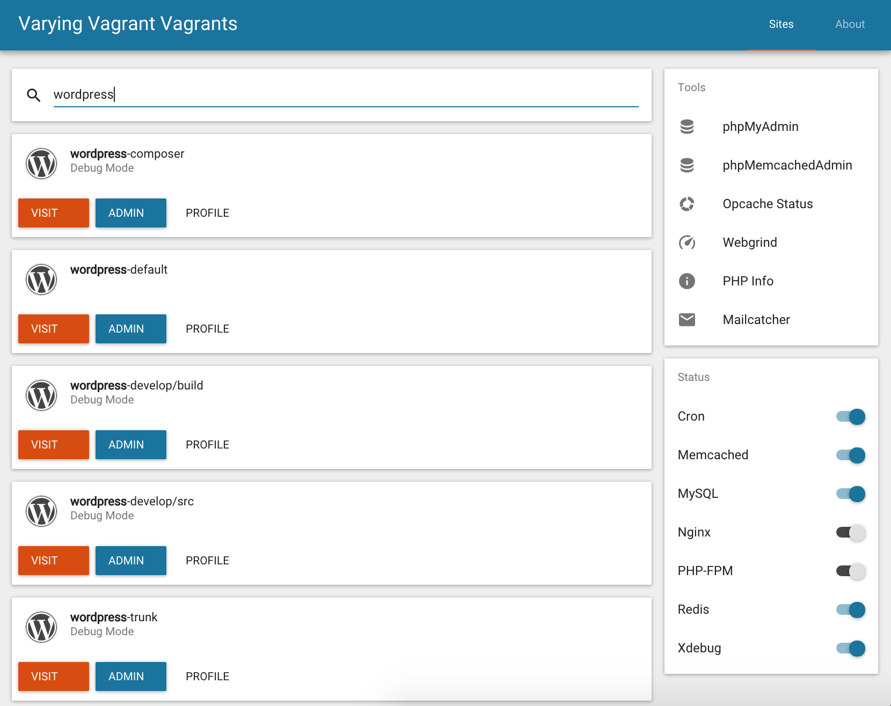

# Material Dashboard for VVV

## What is it?

This is a custom dashboard for [Varying Vagrant Vagrants](https://github.com/Varying-Vagrant-Vagrants/VVV) (VVV) using Material Design and written in React and Redux.

If you're a WordPress developer and don't know about VVV, you're really missing out.

If you don't care about WordPress, though, then I'm afraid you're not going to have much fun here.

## Okay, what does it look like?

## But why?

I needed an excuse to experiment with [Redux](https://github.com/rackt/react-redux), [Material UI](https://github.com/callemall/material-ui) and [Webpack](https://webpack.github.io), but didn't feel like writing another to-do or counter application.

## May I have it?

You can install this project as a custom VVV dashboard by following the steps below.

The project requires the NPM and Composer package management applications, both of which are provided by VVV, so you don't need to install anything else.

1. Using the terminal, `cd` into the `<VVV ROOT>/www` directory.
2. Clone the repository into the `material-dashboard` directory by running `git clone https://github.com/goblindegook/vvv-material-dashboard.git material-dashboard`.
3. Enter the `material-dashboard` directory you've just created.
4. Execute `npm install && npm run build && npm run activate` to build the project.

Your new dashboard interface should now be available at [http://vvv/](http://vvv/). Enjoy!

## Will you continue to develop and support it?

I can neither confirm nor deny the existence of a roadmap.

## Show me something else

Material Dashboard is not the only option out there, go ahead and give these others a try:

* [VVV-Dashboard by @leogopal](https://github.com/leogopal/VVV-Dashboard/)
* [VVV-Dashboard by @topdown](https://github.com/topdown/VVV-Dashboard/)
